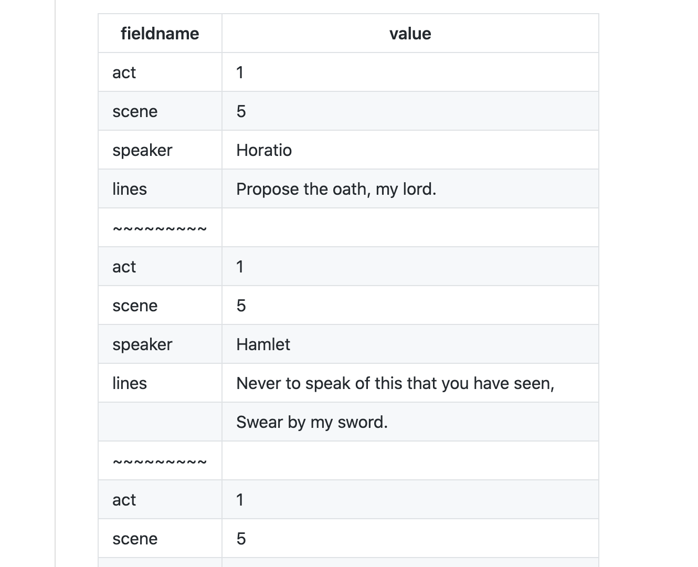

**********
csvflatten
**********

:command:`csvflatten` is a command for producing "flattened" records. Useful for quickly getting a view of records with numerous fields, and for documenting data examples in Markdown-compatible format.

.. contents:: :local:

Description
===========

For every input record, :command:`csvflatten`'s output will contain 2-column rows — ``field,value`` — for each of the record's key-value pairs. This is useful for viewing records one at a time, especially if each row contains many columns.

It's a concept similar to `xsv flatten <https://github.com/BurntSushi/xsv#available-commands>`_, though the structure of "flattened" output differs.

For example, given the following table:

.. csv-table::
   :header: id,product,price

   001,apples,1.50
   002,oranges,2.25

The "flattened" view of its 2 records would look like this:

.. csv-table::
   :header: field,value

   id,001
   product,apples
   price,1.50
   ~~~~~,
   id,002
   product,oranges
   price,2.25

Basic example
-------------

By default, :command:`csvflatten` produces CSV output without word-wrapping long fields (such as the ``lines`` field in the example below). But the most common use-case is to produce *pretty* tabular output, including word-wrapping long fields to the width of the terminal. This is done using the ``-P/--prettify`` flag::

    $ csvflatten examples/hamlet.csv -P

    | fieldname | value                                          |
    | --------- | ---------------------------------------------- |
    | act       | 1                                              |
    | scene     | 5                                              |
    | speaker   | Horatio                                        |
    | lines     | Propose the oath, my lord.                     |
    | ~~~~~~~~~ |                                                |
    | act       | 1                                              |
    | scene     | 5                                              |
    | speaker   | Hamlet                                         |
    | lines     | Never to speak of this that you have seen,     |
    |           | Swear by my sword.                             |
    | ~~~~~~~~~ |                                                |
    | act       | 1                                              |
    | scene     | 5                                              |
    | speaker   | Ghost                                          |
    | lines     | [Beneath] Swear.                               |
    | ~~~~~~~~~ |                                                |
    | act       | 3                                              |
    | scene     | 4                                              |
    | speaker   | Gertrude                                       |
    | lines     | O, speak to me no more;                        |
    |           | These words, like daggers, enter in mine ears; |
    |           | No more, sweet Hamlet!                         |
    | ~~~~~~~~~ |                                                |
    | act       | 4                                              |
    | scene     | 7                                              |
    | speaker   | Laertes                                        |
    | lines     | Know you the hand?                             |

This output is suitable for pasting into a `Markdown file <https://gist.github.com/dannguyen/296461fd1ccdd3719ecb36a6302a65f3>`_  to produce a formatted HTML table:

For reference's sake, this is what :download:`hamlet.csv </../examples/hamlet.csv>` contains::

    act,scene,speaker,lines
    1,5,Horatio,"Propose the oath, my lord."
    1,5,Hamlet,"Never to speak of this that you have seen,
    Swear by my sword."
    1,5,Ghost,[Beneath] Swear.
    3,4,Gertrude,"O, speak to me no more;
    These words, like daggers, enter in mine ears;
    No more, sweet Hamlet!"
    4,7,Laertes,Know you the hand?

(note the multi-line fields for the 2nd and 4th records)

How it compares to existing tools
=================================

Compared to csvkit's``csvlook``
-------------------------------

`csvlook <https://csvkit.readthedocs.io/en/latest/scripts/csvlook.html>`_  doesn't pretty-format multi-line fields, and can also result in very wide tables without ``--max-column-width``::

    $ csvlook examples/hamlet.csv --max-column-width 50

    | act | scene | speaker  | lines                                              |
    | --- | ----- | -------- | -------------------------------------------------- |
    |   1 |     5 | Horatio  | Propose the oath, my lord.                         |
    |   1 |     5 | Hamlet   | Never to speak of this that you have seen,
    Swea... |
    |   1 |     5 | Ghost    | [Beneath] Swear.                                   |
    |   3 |     4 | Gertrude | O, speak to me no more;
    These words, like dagge... |
    |   4 |     7 | Laertes  | Know you the hand?                                 |

Compared to ``xsv flatten``
---------------------------

`xsv flatten <https://github.com/BurntSushi/xsv#available-commands>`_ does do auto-wrapping of long entries, but doesn't produce tableized output::

    $ xsv flatten examples/hamlet.csv

    act      1
    scene    5
    speaker  Horatio
    lines    Propose the oath, my lord.
    #
    act      1
    scene    5
    speaker  Hamlet
    lines    Never to speak of this that you have seen,
    Swear by my sword.
    #
    act      1
    scene    5
    speaker  Ghost
    lines    [Beneath] Swear.
    #
    act      3
    scene    4
    speaker  Gertrude
    lines    O, speak to me no more;
    These words, like daggers, enter in mine ears;
    No more, sweet Hamlet!
    #
    act      4
    scene    7
    speaker  Laertes
    lines    Know you the hand?

Compared to ``tabulate``
------------------------

`python-tabulate <https://pypi.org/project/tabulate/>`_ is a command-line tool for producing a variety of tabular outputs, including ``rst``, ``grid``, and ``html`` formats. However, it does not handle multi-line fields well. Nor does it natively handle the CSV format, e.g. double-quoted values that contain commas, hence, the use of csvkit's `csvformat <https://csvkit.readthedocs.io/en/latest/scripts/csvformat.html>`_ to change delimiters to ``\t`` in the example below::

    $ csvformat -T examples/hamlet.csv | tabulate -f grid -1 -s '\t'

    +------------------------------------------------+---------+-----------+---------------------------------------------+
    | act                                            |   scene | speaker   | lines                                       |
    +================================================+=========+===========+=============================================+
    | 1                                              |       5 | Horatio   | Propose the oath, my lord.                  |
    +------------------------------------------------+---------+-----------+---------------------------------------------+
    | 1                                              |       5 | Hamlet    | "Never to speak of this that you have seen, |
    +------------------------------------------------+---------+-----------+---------------------------------------------+
    | Swear by my sword."                            |         |           |                                             |
    +------------------------------------------------+---------+-----------+---------------------------------------------+
    | 1                                              |       5 | Ghost     | [Beneath] Swear.                            |
    +------------------------------------------------+---------+-----------+---------------------------------------------+
    | 3                                              |       4 | Gertrude  | "O, speak to me no more;                    |
    +------------------------------------------------+---------+-----------+---------------------------------------------+
    | These words, like daggers, enter in mine ears; |         |           |                                             |
    +------------------------------------------------+---------+-----------+---------------------------------------------+
    | No more, sweet Hamlet!"                        |         |           |                                             |
    +------------------------------------------------+---------+-----------+---------------------------------------------+
    | 4                                              |       7 | Laertes   | Know you the hand?                          |
    +------------------------------------------------+---------+-----------+---------------------------------------------+

That said, if you like ``tabulate``'s table-formatting options, such as ``-f grid``, you can pipe :command:`csvflatten` (and :command:`csvformat` to convert to tab-delimiters) into ``tabulate`` like so::

    $ csvflatten --eor 'none' examples/hamlet.csv | csvformat -T \
        tabulate -f grid -1 -s '\t'

    +---------+------------------------------------------------+
    | field   | value                                          |
    +=========+================================================+
    | act     | 1                                              |
    +---------+------------------------------------------------+
    | scene   | 5                                              |
    +---------+------------------------------------------------+
    | speaker | Horatio                                        |
    +---------+------------------------------------------------+
    | lines   | Propose the oath, my lord.                     |
    +---------+------------------------------------------------+
    | act     | 1                                              |
    +---------+------------------------------------------------+
    | scene   | 5                                              |
    +---------+------------------------------------------------+
    | speaker | Hamlet                                         |
    +---------+------------------------------------------------+
    | lines   | Never to speak of this that you have seen,     |
    +---------+------------------------------------------------+
    |         | Swear by my sword.                             |
    +---------+------------------------------------------------+
    | act     | 1                                              |
    +---------+------------------------------------------------+
    | scene   | 5                                              |
    +---------+------------------------------------------------+
    | speaker | Ghost                                          |
    +---------+------------------------------------------------+
    | lines   | [Beneath] Swear.                               |
    +---------+------------------------------------------------+
    | act     | 3                                              |
    +---------+------------------------------------------------+
    | scene   | 4                                              |
    +---------+------------------------------------------------+
    | speaker | Gertrude                                       |
    +---------+------------------------------------------------+
    | lines   | O, speak to me no more;                        |
    +---------+------------------------------------------------+
    |         | These words, like daggers, enter in mine ears; |
    +---------+------------------------------------------------+
    |         | No more, sweet Hamlet!                         |
    +---------+------------------------------------------------+
    | act     | 4                                              |
    +---------+------------------------------------------------+
    | scene   | 7                                              |
    +---------+------------------------------------------------+
    | speaker | Laertes                                        |
    +---------+------------------------------------------------+
    | lines   | Know you the hand?                             |
    +---------+------------------------------------------------+

Reference: Options and usage
============================

-P/--prettify
-------------

Print output in tabular format instead of CSV. Unless ``-L/--max-length`` is explicitly specified, long values are split into multiple rows based on the current terminal width.

-L/--max-length [integer]
--------------------------

Specify a max character length for field values; values that exceed this length are split into multiple rows. This is useful for producing output easier to view in a spreadsheet::

    $ csvflatten -L 5 examples/abc123.csv

    field,value
    code,alfa
    blob,01234
    ,56789
    ~~~~~,
    code,beta
    blob,ABCDE
    ,FGHIJ

Or combining with the ``-P/--prettify`` option::

    $ csvflatten -P -L 5 examples/abc123.csv

    | field | value |
    | ----- | ----- |
    | code  | alfa  |
    | blob  | 01234 |
    |       | 56789 |
    | ~~~~~ |       |
    | code  | beta  |
    | blob  | ABCDE |
    |       | FGHIJ |

The default behavior is as follows:

- *Without* ``--prettify`` mode, this value is set to ``0``, i.e. no splitting of long values.
- *With* ``--prettify`` mode, this value is automatically set to the width of the terminal. To disable this behavior, you can explicitly set ``--max-length 0``

-B/--chunk-labels
-----------------

When a value is chopped into chunks across multiple rows, by default, the  ``field`` (i.e. first column) is filled in for the value's *first* row, then left blank for its subsequent rows::

    | field |  value  |
    +-------+---------+
    | id    | 001     |
    | title | this is |
    |       | a story |
    |       | of love |

If the ``--chunk-labels`` flag is set, each subsequent ``field`` will be filled with an incremental label, e.g.::

    |  field   |  value  |
    +----------+---------+
    | id       | 001     |
    | title    | this is |
    | title__1 | a story |
    | title__2 | of love |

-E/--eor [END_OF_RECORD_MARKER (string)]
----------------------------------------

By default, each record is separated by having a string of *tildes* in ``field``, e.g.::

    | field |  value  |
    +-------+---------+
    | id    | 001     |
    | title | this is |
    |       | a story |
    |       | of love |
    | ~~~~~ |         |
    | id    | 002     |
    | title | Book 2  |

Set ``'none'`` to disable::

    | field |  value  |
    +-------+---------+
    | id    | 001     |
    | title | this is |
    |       | a story |
    |       | of love |
    | id    | 002     |
    | title | Book 2  |

Or to a value of your choosing::

    $ csvflatten -E 'NEW-RECORD' data.csv

    |   field    |  value  |
    +------------+---------+
    | id         | 001     |
    | title      | this is |
    |            | a story |
    |            | of love |
    | NEW-RECORD |         |
    | id         | 002     |
    | title      | Book 2  |

-R/--rec-id
-----------

Include a ``_recid_`` column that contains the 0-based index for the respective record::

    | _recid_ | field |  value  |
    +---------+-------+---------+
    |       0 | id    | 001     |
    |       0 | title | this is |
    |       0 |       | a story |
    |       0 |       | of love |
    |       1 | id    | 002     |
    |       1 | title | Book 2  |

Note that ``-rec-id`` by default disables the end-of-record separator

Common scenarios and use cases
==============================

TK TK
